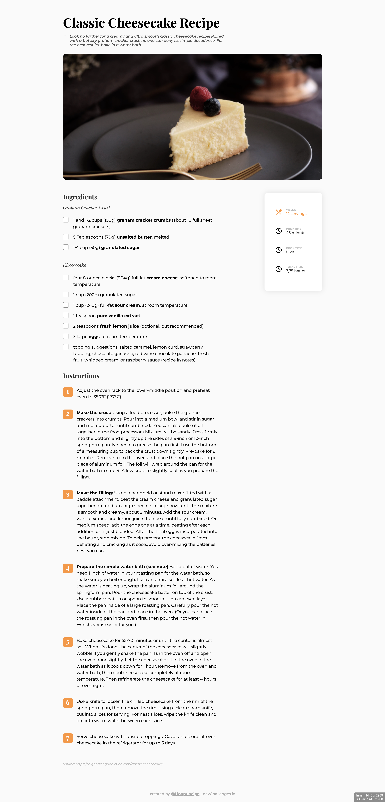
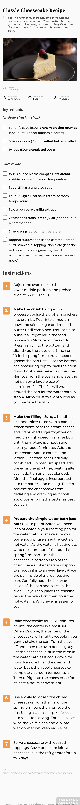

<!-- Please update value in the {}  -->

<h1 align="center">Recipe Blog Challenge</h1>

   Solution for a challenge from  <a href="http://devchallenges.io" target="_blank">Devchallenges.io</a>.

  <h3>
    <a href="https://recipe-blog-challenge.vercel.app/">
      Demo
    </a>
     | 
    <a href="https://github.com/Lionprincipe/recipe-blog-challenge">
      Solution
    </a>
     | 
    <a href="https://devchallenges.io/challenges/OEKdUZ6xs0h99C38XVht">
      Challenge
    </a>
  </h3>

<!-- TABLE OF CONTENTS -->

## Table of Contents

- [Table of Contents](#table-of-contents)
- [Overview](#overview)
  - [Built With](#built-with)
- [Features](#features)
- [How To Use](#how-to-use)
- [Acknowledgements](#acknowledgements)
- [Contact](#contact)

<!-- OVERVIEW -->

## Overview

- What was your experience?
 tried using the font-size 62.5% and em unit tricks control a website size.
- What have you learned/improved?
responsiveness using fontsize and  em unit to scale.

<h3 align="center">Desktop</h3>

<h3 align="center">Mobile</h3>

   
   

### Built With

<!-- This section should list any major frameworks that you built your project using. Here are a few examples.-->

- [css3](https://developer.mozilla.org/en/docs/Web/CSS/Reference)
- [Html5](https://developer.mozilla.org/en-US/docs/Glossary/HTML5)

## Features

<!-- List the features of your application or follow the template. Don't share the figma file here :) -->

This application/site was created as a submission to a [DevChallenges](https://devchallenges.io/challenges) challenge. The [challenge](https://devchallenges.io/challenges/OEKdUZ6xs0h99C38XVht) was to build an application to complete the following user stories:

- [x] User story: I can see a recipe with ingredients and instructions
- [x] User story:  I can select a checkbox if I have the ingredients
- [x] User story: I can see the number of servings, baking times

## How To Use

To clone and run this application, you'll need [Git](https://git-scm.com) and [Node.js](https://nodejs.org/en/download/) (which comes with [npm](http://npmjs.com)) installed on your computer. From your command line:

## Acknowledgements

<!-- This section should list any articles or add-ons/plugins that helps you to complete the project. This is optional but it will help you in the future. For exmpale -->

- [Steps to replicate a design with only HTML and CSS](https://devchallenges-blogs.web.app/how-to-replicate-design/)
- [Node.js](https://nodejs.org/)
- [Marked - a markdown parser](https://github.com/chjj/marked)

## Contact

- GitHub [@Lionprincipe](https://github.com/Lionprincipe)
- Twitter [@mouendoulionel](https://twitter.com/mouendoulionel)